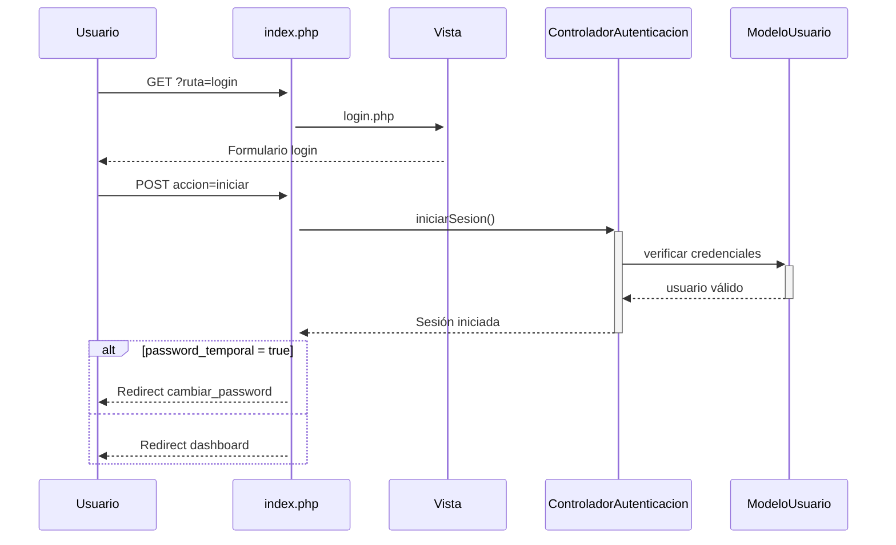
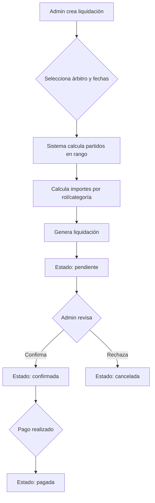

Este documento describe la arquitectura técnica del módulo Sprint-3, que incluye autenticación, gestión de partidos, liquidaciones, licencias y árbitros bajo un patrón MVC (Modelo–Vista–Controlador) con PHP 8, Apache (XAMPP) y MySQL.

## Objetivos arquitectónicos

- Separación de responsabilidades clara (MVC) para facilitar mantenimiento y escalabilidad.
- Sencillez operativa: sin frameworks externos; uso de PHP nativo con PDO.
- Seguridad razonable por defecto: control de acceso por rol, saneado mínimo de entradas, reglas de Apache y manejo de errores controlado.
- Rendimiento básico: cacheo de estáticos vía cabeceras y consultas SQL indexadas.
- Trazabilidad: puntos de log centralizados (error_log) y mensajes flash en interfaz.
- Accesibilidad: cumplimiento de estándares WCAG AAA y principios de usabilidad de Nielsen.

## Visión general del sistema

- Enrutamiento: `.htaccess` redirige todas las rutas no físicas a `index.php`.
- Controladores: orquestan lógica de aplicación y seguridad por rol.
- Modelos: encapsulan acceso a datos con PDO y SQL parametrizado.
- Vistas: archivos PHP delgados que renderizan HTML sin lógica de negocio.
- Estáticos: servidos directamente por Apache desde `css/`, `js/`, `assets/` con cache-control.
- API: endpoints JSON para operaciones AJAX (disponibilidad, estadísticas).

## Tecnologías y versiones

- PHP ≥ 8.0 (uso de `match`, propiedades tipadas, `Throwable`).
- Servidor web: Apache (XAMPP en Windows) con `mod_rewrite` y `mod_headers`.
- Base de datos: MySQL 8.x (compatible MariaDB) vía PDO.
- Cliente: HTML5 + CSS + Bootstrap 5.3 + JavaScript.
- Testing: PHPUnit para pruebas unitarias, de integración y funcionales.

## Estructura de carpetas

```
src/
  sql/              # SQL de creación y datos (bbdd.sql, datos.sql)
  tests/            # Pruebas automatizadas (PHPUnit)
    unit/           # Pruebas unitarias de modelos
    integration/    # Pruebas de integración
    functional/     # Pruebas funcionales de controladores
    user/           # Checklists de pruebas de usuario (UAT)
  www/
    .htaccess       # Reescritura de URLs y cache estáticos
    config.php      # Configuración global, sesión, errores
    index.php       # Front Controller (routing simple por querystring)
    controladores/  # Controladores MVC (9 controladores)
    modelos/        # Modelos de datos (8 modelos)
    vistas/         # Vistas PHP (24 vistas + HTML estáticos)
    css/            # Hojas de estilo (estilos.css, nielsen.css, wcag-aaa.css)
    js/             # Scripts de interacción (11 archivos JS)
    assets/imagenes # Recursos estáticos
```

## Configuración y bootstrap

Archivo `src/www/config.php`:
- Parámetros de BD (`BD_HOST`, `BD_NOMBRE`, `BD_USUARIO`, `BD_PASSWORD`).
- `APP_DEPURACION` para alternar verbosidad de errores.
- Zona horaria y codificación interna UTF-8.
- Inicio de sesión (`session_start()` si procede).
- `set_error_handler` y `set_exception_handler` para capturar y registrar errores.

Archivo `src/www/.htaccess`:
- `RewriteEngine On` y `RewriteRule` al Front Controller.
- Bloqueo de acceso directo a `modelos/`, `controladores/` y archivos sensibles.
- Forzado de `AddDefaultCharset UTF-8`.
- Cache-Control para `css|js|png|jpg|gif`.

## Enrutamiento y rutas principales

El Front Controller (`index.php`) determina `ruta` y `accion` (querystring o POST):

### Autenticación
- `login`:
  - GET: muestra vista de login.
  - POST (`accion=iniciar`): `ControladorAutenticacion::iniciarSesion()`.
- `logout`: cierra sesión.
- `cambiar_password`:
  - GET: muestra formulario de cambio de contraseña.
  - POST (`accion=cambiar`): `ControladorAutenticacion::cambiarPassword()`.
  - Nota: se fuerza cambio si `password_temporal = true`.

### Dashboard
- `dashboard`:
  - Determina vista según `tipo_usuario` (`administrador`, `arbitro`).
  - Admin: muestra estadísticas globales (usuarios, árbitros, partidos, liquidaciones).
  - Árbitro: muestra partidos próximos y completados.

### Gestión de Partidos
- `partidos` (admin):
  - `crear`, `actualizar`, `eliminar`, `editar`, `form`, `obtener` → `ControladorPartido`.
  - default → listado de partidos.
- `mis_partidos` (árbitro): lista de partidos asignados con rol contextual (1º Árbitro, 2º Árbitro, Anotador).

### Gestión de Usuarios
- `usuarios` (admin):
  - `crear`, `form`, `eliminar`, `editar`, `actualizar`, `obtener_arbitro` → `ControladorUsuario`.
  - default → listado de usuarios.

### Gestión de Árbitros
- `arbitros` (admin):
  - `detalle`, `editar`, `actualizar`, `estadisticas`, `consultar_disponibilidad` → `ControladorArbitro`.
  - default → listado de árbitros con estadísticas.
- `lista_arbitros` (árbitro): lista de compañeros árbitros designados en partidos.

### Gestión de Licencias
- `licencias` (admin):
  - `crear`, `form`, `editar`, `actualizar`, `eliminar` → `ControladorLicencia`.
  - default → listado de licencias.

### Gestión de Liquidaciones
- `liquidaciones` (admin):
  - `crear`, `form`, `detalle`, `editar`, `actualizar`, `eliminar`, `regenerar`, `rectificaciones`, `gestionar_rectificacion` → `ControladorLiquidacion`.
  - default → listado de liquidaciones.
- `mis_liquidaciones` (árbitro):
  - `detalle`, `solicitar_rectificacion` → `ControladorLiquidacion`.
  - default → listado de liquidaciones propias.

### Disponibilidad
- `disponibilidad_arbitros` (admin): formulario/consulta de disponibilidad de árbitros.
- `disponibilidad` (árbitro): ver/guardar disponibilidad propia.

### Perfil
- `perfil`: vista/edición de perfil del usuario autenticado.

### API (AJAX)
- `api`:
  - `recurso=disponibilidad_fecha`: obtiene árbitros disponibles por fecha.
  - `recurso=estadisticas_arbitro`: obtiene estadísticas de un árbitro.

### Otros
- `unauthorized`: página de acceso denegado (HTTP 403).
- default: página 404.

Control de acceso: comprobaciones por rol antes de entrar a acciones sensibles (p.ej., `partidos`, `usuarios`, `liquidaciones`).

## Controladores y responsabilidades

### Controladores de Autenticación y Perfil
- `controlador_autenticacion.php`
  - Login/Logout, verificación `autenticado()` y rol de usuario.
  - Gestión de cambio de contraseña obligatorio (`password_temporal`).
- `controlador_perfil.php`
  - Visualización/edición de perfil del usuario autenticado.

### Controladores de Gestión (Admin)
- `controlador_partido.php`
  - CRUD de partidos, saneado y validación de datos, render de vistas.
  - Obtención de partidos individuales vía AJAX.
- `controlador_usuario.php`
  - Alta/listado/edición/eliminación de usuarios.
  - Creación automática de registro en tabla `arbitros` para usuarios tipo árbitro.
- `controlador_arbitro.php`
  - Listado con estadísticas, detalle, edición de árbitros.
  - Consulta de disponibilidad por fecha (AJAX).
  - Lista de compañeros árbitros para usuarios árbitro.
- `controlador_licencia.php`
  - CRUD de licencias de árbitros.
  - Histórico de cambios de licencia.
- `controlador_liquidacion.php`
  - CRUD de liquidaciones.
  - Gestión de rectificaciones (admin y árbitro).
  - Regeneración de partidos asociados a liquidación.

### Controladores de Disponibilidad
- `controlador_disponibilidad.php`
  - Gestión de disponibilidad del árbitro autenticado.
- `controlador_disponibilidad_admin.php`
  - Consulta de disponibilidad de árbitros por fecha/turno (admin).

## Modelos y entidades de datos

### Modelo base
`modelo_base.php`: inicializa `$this->conexion` (PDO) y utilidades comunes para todos los modelos.

### Modelos específicos

| Modelo | Tabla | Descripción |
|--------|-------|-------------|
| `modelo_usuario.php` | `usuarios` | Gestión de usuarios (admin/árbitro) |
| `modelo_arbitro.php` | `arbitros` | Datos de árbitros, estadísticas, niveles de licencia |
| `modelo_partido.php` | `partidos` | CRUD de partidos, filtros por árbitro |
| `modelo_categoria.php` | `categorias` | Categorías con precios por rol |
| `modelo_disponibilidad.php` | `disponibilidad_arbitros` | Disponibilidad por fecha/turno |
| `modelo_licencia.php` | `licencias_arbitros` | Histórico de licencias |
| `modelo_liquidacion.php` | `liquidaciones`, `liquidaciones_partidos`, `rectificaciones_liquidaciones` | Gestión completa de liquidaciones |

### Entidades principales (ver `src/sql/bbdd.sql`)

#### `usuarios`
- `id`, `tipo_usuario` (enum: administrador, arbitro), `usuario`, `email`, `password`, `password_temporal`, `activo`, `fecha_creacion`.
- Unique `email`.

#### `arbitros`
- `id`, `usuario_id` (FK → usuarios.id, CASCADE), `nombre`, `apellidos`, `dni`, `telefono`, `ciudad`, `iban`.
- `licencia` (enum: colaborador, anotador, habilitado_n1, habilitado_n2, habilitado_n3, n1, n2, n3c, n3b, n3a).
- `numero_licencia`, `numero_matricula`.

#### `categorias`
- `id`, `nombre` (unique), `descripcion`.
- `precio_arbitro1`, `precio_arbitro2`, `precio_anotador` (decimales para cálculo de liquidaciones).

#### `partidos`
- `id`, `equipo_local`, `equipo_visitante`, `categoria_id` (FK), `fecha`, `pabellon_nombre`.
- `arbitro_principal_id`, `arbitro_segundo_id`, `anotador_id` (FK → arbitros, ON DELETE SET NULL).
- `estado` (enum: programado, finalizado, cancelado), `fecha_actualizacion`.
- Índices por categoría, fecha, equipos.

#### `disponibilidad_arbitros`
- `id`, `arbitro_id` (FK → arbitros, CASCADE), `fecha`, `manana`, `tarde`, `observacion`.
- UNIQUE (arbitro_id, fecha), índice por fecha.

#### `licencias_arbitros`
- `id`, `arbitro_id` (FK → arbitros, CASCADE), `fecha_expedicion`, `nivel_licencia`.
- `fecha_creacion`, `fecha_actualizacion`.

#### `liquidaciones`
- `id`, `arbitro_id` (FK → arbitros, CASCADE).
- `tipo_liquidacion` (enum: JUDEX, SENIOR, NACIONALES), `fecha_inicio`, `fecha_fin`.
- `numero_partidos`, `total_importe`, `observaciones`.
- `estado` (enum: pendiente, confirmada, pagada, cancelada, rectificacion).
- `fecha_creacion`, `fecha_confirmacion`.
- Índices por árbitro, estado, fecha.

#### `liquidaciones_partidos`
- `id`, `liquidacion_id` (FK → liquidaciones, CASCADE), `partido_id` (FK → partidos, CASCADE).
- `rol_arbitro`, `importe_partido`.

#### `rectificaciones_liquidaciones`
- `id`, `liquidacion_id` (FK → liquidaciones, CASCADE), `partido_id`, `arbitro_id` (FK → arbitros, CASCADE).
- `motivo`, `observaciones`, `estado` (enum: pendiente, aprobada, rechazada).
- `respuesta_admin`, `fecha_solicitud`, `fecha_respuesta`, `importe_partido_solicitado`.

## Vistas y recursos estáticos

### Vistas PHP (24 vistas)

#### Autenticación y Navegación
- `login.php` - Formulario de inicio de sesión
- `cambiar_password.php` - Formulario de cambio de contraseña
- `unauthorized.php` - Acceso denegado (403)
- `menu_admin.php` - Menú de navegación para administradores
- `menu_arbitro.php` - Menú de navegación para árbitros

#### Dashboards
- `dashboard_admin.php` - Panel principal de administrador con estadísticas
- `dashboard_arbitro.php` - Panel principal de árbitro con próximos partidos

#### Gestión de Partidos
- `partidos_listado.php` - Lista de partidos (admin)
- `mis_partidos.php` - Lista de partidos asignados (árbitro)

#### Gestión de Usuarios y Árbitros
- `usuarios_listado.php` - Lista de usuarios (admin)
- `arbitros_listado.php` - Lista de árbitros con estadísticas (admin)
- `arbitro_detalle.php` - Detalle de un árbitro
- `arbitro_editar.php` - Edición de árbitro
- `arbitros_companeros.php` - Lista de compañeros árbitros

#### Gestión de Licencias
- `licencias_listado.php` - Lista de licencias

#### Gestión de Liquidaciones
- `liquidaciones_listado.php` - Lista de liquidaciones (admin)
- `liquidacion_formulario.php` - Formulario crear/editar liquidación
- `liquidacion_detalle.php` - Detalle de liquidación
- `mis_liquidaciones.php` - Lista de liquidaciones propias (árbitro)
- `rectificaciones_listado.php` - Lista de rectificaciones pendientes

#### Disponibilidad
- `disponibilidad.php` - Gestión de disponibilidad (árbitro)
- `disponibilidad_arbitros.php` - Consulta de disponibilidad (admin)

#### Perfil
- `perfil.php` - Vista/edición de perfil

### Hojas de estilo
- `css/estilos.css` - Estilos principales de la aplicación
- `css/nielsen.css` - Estilos para principios de usabilidad de Nielsen
- `css/wcag-aaa.css` - Estilos para cumplimiento WCAG AAA

### Scripts JavaScript (11 archivos)
- `js/app.js` - Funcionalidades generales
- `js/arbitros.js` - Gestión de árbitros
- `js/cambiar_password.js` - Validación de cambio de contraseña
- `js/disponibilidad.js` - Gestión de disponibilidad
- `js/licencias.js` - Gestión de licencias
- `js/liquidaciones.js` - Gestión de liquidaciones
- `js/modales.js` - Manejo de modales Bootstrap
- `js/nielsen.js` - Interacciones de usabilidad
- `js/partidos.js` - Gestión de partidos
- `js/usuarios.js` - Gestión de usuarios
- `js/wcag-aaa.js` - Funcionalidades de accesibilidad

## Seguridad

- Control de acceso por rol en rutas sensibles (admin vs árbitro).
- Forzado de cambio de contraseña temporal al primer inicio de sesión.
- Saneado de entradas en controladores antes de persistir.
- Consultas parametrizadas (prevención de SQLi) vía PDO.
- `.htaccess` bloquea acceso directo a `modelos/`, `controladores/` y archivos de lógica.
- Sesión iniciada de forma centralizada; mensajes flash no persistentes.
- Charset forzado a UTF-8; `htmlspecialchars` en renderizado de campos.
- Hash de contraseñas con `password_hash()`/`password_verify()`.

Recomendaciones adicionales (futuras):
- CSRF tokens en formularios de cambios (`crear/actualizar/eliminar`).
- Cabeceras `SameSite`/`Secure` para cookies en despliegues HTTPS.
- Rate limiting para intentos de login fallidos.

## Manejo de errores y logging

- `config.php` define `set_error_handler` y `set_exception_handler`:
  - En producción (`APP_DEPURACION=false`): log en `error_log`, mensaje genérico al usuario.
  - En desarrollo: salida controlada (debug) del mensaje capturado.
- Respuestas JSON para endpoints API con estructura consistente (`success`/`error`).


## Flujos clave

### 1) Autenticación


### 2) CRUD de partidos (admin)
- **Listado**: `index.php?ruta=partidos` → `ControladorPartido::listado()` → `ModeloPartido::obtenerTodos()` → vista `partidos_listado`.
- **Crear**: formulario POST `accion=crear` → saneado + validación → `ModeloPartido::crear()` → flash y redirect.
- **Editar/Actualizar**: `accion=editar` renderiza formulario modal; POST `accion=actualizar` actualiza registro.
- **Eliminar**: POST `accion=eliminar` elimina y redirige.
- **Obtener (AJAX)**: `accion=obtener` devuelve JSON con datos del partido.

### 3) Gestión de liquidaciones (admin)


### 4) Solicitud de rectificación (árbitro)
- Árbitro accede a `mis_liquidaciones` y ve detalle.
- Solicita rectificación indicando motivo y observaciones.
- Admin revisa en `liquidaciones?accion=rectificaciones`.
- Admin aprueba o rechaza con respuesta.
- Estado de rectificación actualizado.

### 5) Mis partidos (árbitro)
- Ruta `mis_partidos` filtra partidos por el árbitro autenticado.
- Etiqueta el rol (`1º Árbitro`, `2º Árbitro`, `Anotador`).
- Separa en partidos futuros y pasados/completados.

### 6) Gestión de disponibilidad
- **Árbitro**: accede a `disponibilidad`, marca días/turnos disponibles.
- **Admin**: consulta `disponibilidad_arbitros` por fecha para asignar árbitros a partidos.

## Decisiones arquitectónicas (resumen)

- **MVC sin framework**: menor dependencia y curva de aprendizaje; conviene reforzar con estándares internos de código.
- **Front Controller único via `.htaccess`**: simplifica rutas; permite escalar con nuevos controladores.
- **PDO + SQL explícito**: control y transparencia de consultas; se mantienen índices y FKs para integridad.
- **Estructura de carpetas estricta**: separación de vistas, controladores, modelos y estáticos.
- **Expresión `match` de PHP 8**: enrutamiento limpio y legible en el Front Controller.
- **APIs JSON internas**: endpoints ligeros para operaciones AJAX (disponibilidad, estadísticas).
- **Testing con PHPUnit**: estructura de tests unitarios, de integración y funcionales.

## Testing

### Estructura de tests
```
src/tests/
├── bootstrap.php           # Configuración inicial de tests
├── composer.json           # Dependencias de testing
├── phpunit.xml             # Configuración PHPUnit
├── unit/                   # Tests unitarios
│   ├── TestCase.php        # Clase base para tests unitarios
│   └── modelos/            # Tests de modelos
│       ├── ModeloArbitroTest.php
│       ├── ModeloDisponibilidadTest.php
│       ├── ModeloLiquidacionTest.php
│       ├── ModeloPartidoTest.php
│       └── ModeloUsuarioTest.php
├── integration/            # Tests de integración
│   └── FlujoCompletoTest.php
├── functional/             # Tests funcionales
│   ├── FunctionalTestCase.php
│   └── controladores/
│       ├── ControladorAutenticacionTest.php
│       └── ControladorUsuarioTest.php
├── sql/                    # Scripts SQL para tests
│   └── setup_test_db.sql
└── user/                   # Pruebas de usuario (UAT)
    ├── CHECKLIST_PRUEBAS.md
    └── PRUEBAS_USUARIO_UAT.md
```

### Tipos de tests
- **Unitarios**: prueban modelos aislados con mocks de PDO.
- **Integración**: prueban flujos completos con base de datos real.
- **Funcionales**: prueban controladores simulando peticiones HTTP.
- **UAT**: checklists manuales para pruebas de aceptación de usuario.

## Calidad y mantenimiento

- **Clean Code**: nombres en español, cohesión por clase/controlador, funciones cortas y documentadas con PHPDoc.
- **Accesibilidad**: cumplimiento WCAG AAA documentado en `docs/Diseño/Usabilidad/`.
- **Usabilidad**: aplicación de principios de Nielsen documentada.
- Consola del navegador y PHP sin errores ni warnings en ejecución normal; usar `APP_DEPURACION` en desarrollo.
- Dependencias: PHPUnit para testing; mantener PHP actualizado (≥ 8.0) y MySQL con parches de seguridad actuales.

---

 Antonio Gat Fernández | agatf02@educarex.es